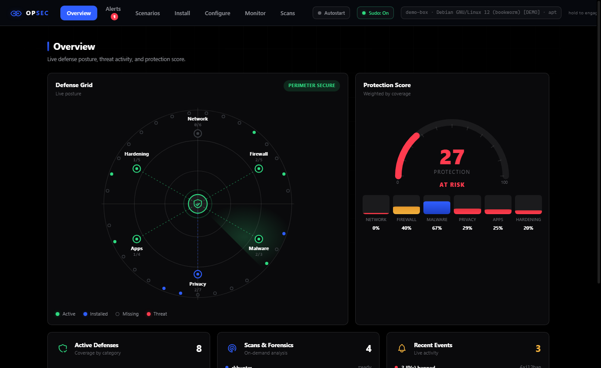
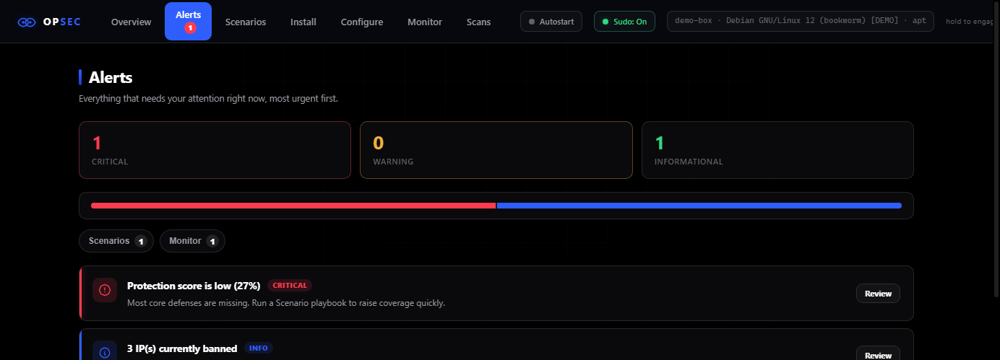
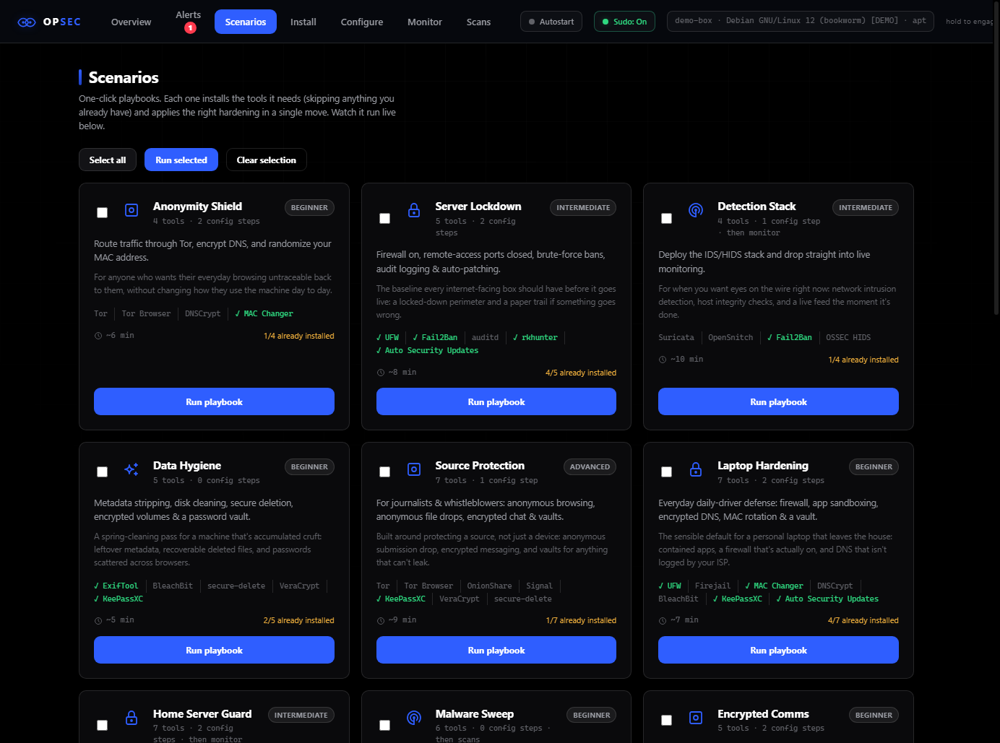
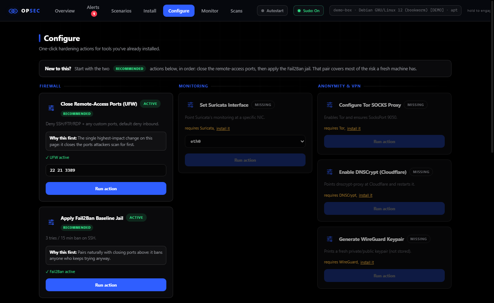
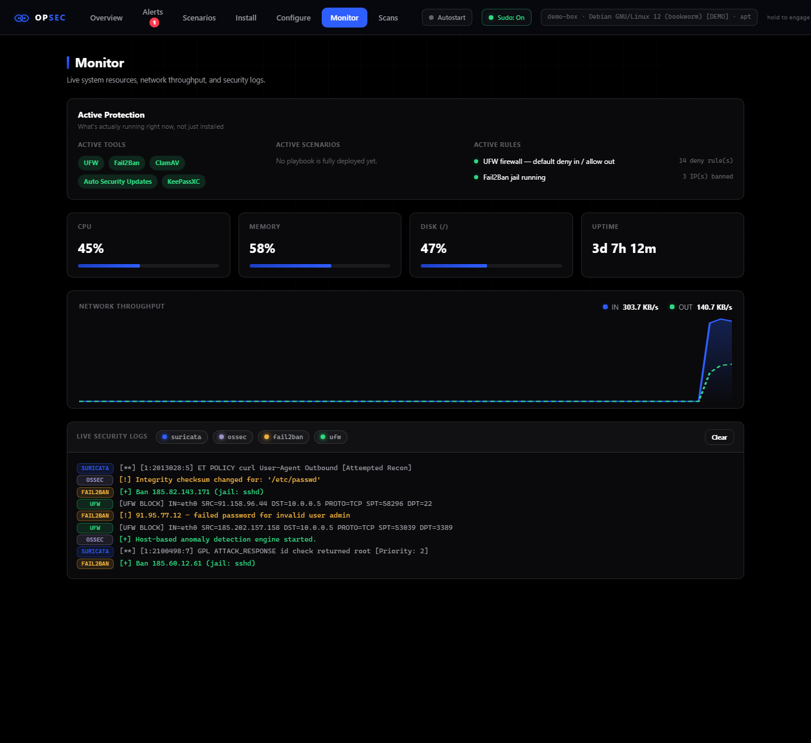
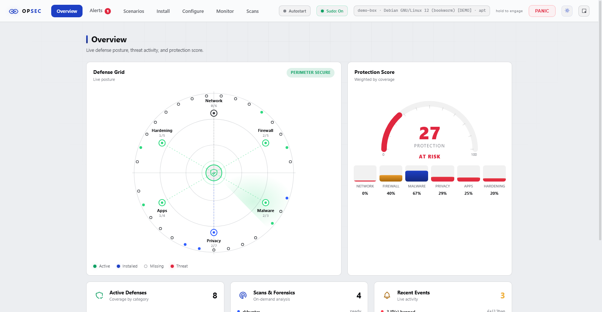
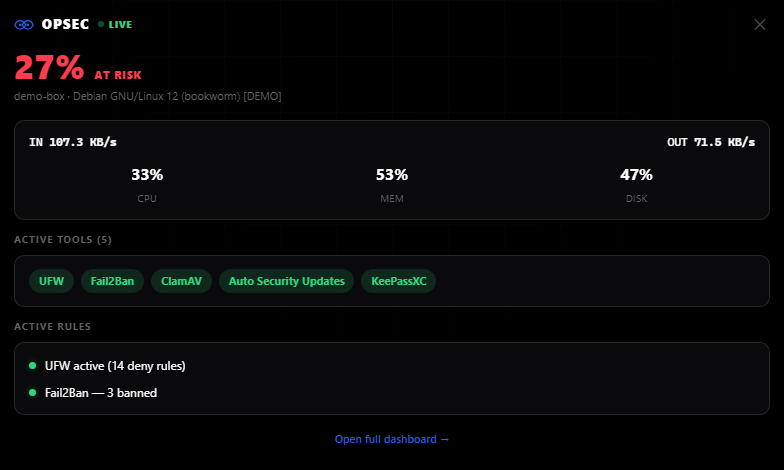

# OPSEC Dashboard 🛡️

A local, browser-based control panel for hardening and monitoring a Linux
box: install privacy/security tools, run one-click hardening playbooks,
watch live traffic and logs, run scans, and hit a kill switch if something
looks wrong — all from `http://127.0.0.1:8765`, never exposed beyond your
own machine.

This is a rewrite of the original OPSEC bash-menu tool. The old per-distro
CLI scripts (`Ubuntu Opsec/`, `Other Opsec/`) still work and are kept under
[`legacy/`](legacy/) for reference, but the dashboard is now the recommended
way to run this.



## What it does

- **30 tools across 6 categories** — VPN/anonymity (Tor, WireGuard, OpenVPN,
  strongSwan, Mullvad, ProtonVPN), firewall & monitoring (UFW, OpenSnitch,
  Suricata, Fail2Ban, OSSEC HIDS), malware/rootkit defense (rkhunter,
  chkrootkit, ClamAV), privacy hygiene (DNSCrypt, MAC randomization,
  ExifTool, BleachBit, VeraCrypt, Cryptomator, secure-delete), hardening
  (Firejail, unattended upgrades, Lynis, auditd, USBGuard), and secure apps
  (Tor Browser, KeePassXC, Signal, OnionShare) — installed with live
  streamed output, distro-detected (`apt`/`dnf`/`pacman`/`zypper`).
- **17 Scenarios** — one-click playbooks ("Anonymity Shield", "Server
  Lockdown", "Detection Stack", "Public Wi-Fi Defense", "Incident Response
  Kit", ...) that install everything they need (skipping what you already
  have) and apply the right hardening actions in one run. Multi-select and
  queue several at once.
- **One-click Configure actions** — close remote-access ports via UFW,
  apply a Fail2Ban baseline jail, enable DNSCrypt, point Suricata at a NIC,
  configure Tor's SOCKS proxy, generate a WireGuard keypair, repair a
  half-configured package manager — each shows whether it's already active,
  not just installed.
- **A real Monitor tab** — live CPU/RAM/disk gauges, a network-throughput
  graph read from `/proc/net/dev`, an "Active Protection" panel that shows
  what's actually running right now (not just installed), and a merged
  live tail of Suricata/OSSEC/Fail2Ban/UFW logs.
- **Alerts** — everything that needs attention, most urgent first, with a
  severity breakdown and one click to jump to the tab that fixes it.
- **A Panic button** — instantly denies all inbound/outbound traffic except
  loopback (hold-to-engage, so it can't fire by accident), with a
  persistent banner reminding you it's on until you disengage it.
- **A desktop widget** — pop out a small, chrome-less window from the
  topbar and drag it anywhere on your screen: live protection score, active
  tools, firewall/ban status, and network throughput, without a full
  browser tab open. See [below](#desktop-widget).
- **Dark and light themes**, a global "run with/without sudo" toggle, and
  full Stop/Cancel support on every long-running install, scenario, or scan.
- **Autostart** — one click installs a systemd unit so the dashboard (and
  everything that depends on it, like the widget) survives a reboot.

## Getting started

Requirements: a Linux host (Debian/Ubuntu, Fedora, or Arch-based), `bash`,
and `python3` (auto-installed by the launcher if missing).

```bash
git clone https://github.com/qw3r1y/OpseC
cd OpseC
chmod +x opsec.sh
./opsec.sh
```

The script re-launches itself with `sudo` if needed (installing packages and
managing services requires root), starts the local server, and opens your
browser to the dashboard automatically. If it doesn't open on its own, the
terminal prints the plain URL to visit — just `http://127.0.0.1:8765/`,
nothing to copy into it.

## Using the dashboard

| Tab | What it does |
|---|---|
| **Overview** | Protection score, a live radar of every category's coverage, and real firewall/threat status. |
| **Alerts** | Everything that needs attention right now, ranked by severity, with a one-click "Review" that jumps to the tab that fixes it. |
| **Scenarios** | One-click playbooks — pick one or several, hit run, watch every step stream live. Each card shows how much of it you already have. |
| **Install** | Tick the tools you want, hit *Install selected*, watch the live console. Already-installed tools show *Uninstall* instead. |
| **Configure** | One-click hardening actions, grouped (Firewall, Monitoring, Anonymity & VPN, Maintenance), each showing Active/Installed/Missing status for what it depends on. |
| **Monitor** | An "Active Protection" summary (active tools, active scenarios, active firewall/IDS rules), live CPU/memory/disk gauges, a real network-throughput graph, and merged log tailing. |
| **Scans** | Run rkhunter, chkrootkit, a ClamAV home-directory scan, or a full Lynis audit, with streamed output. |

The **Panic** button in the top bar is an emergency network kill switch: hold
it to engage (so it can't fire from a stray click) and it sets UFW to deny
all inbound and outbound traffic except loopback. A persistent red banner
reminds you it's on until you disengage it.

Every install/scenario/scan has a **Stop** button, and if something is
genuinely waiting on an interactive prompt (rare — almost everything runs
non-interactively on purpose), the console has an input box to answer it
without ever needing a separate terminal.

<p align="center">
  
</p>

<p align="center">
  
  
</p>

<p align="center">
  
</p>

### Dark and light themes

Click the small icon at the far right of the top bar to switch. The choice
is remembered across restarts. The Defense Grid radar, Protection Score
gauge, and every live console stay dark in both themes — they're meant to
read like an instrument screen, not a page that happens to be dark.

<p align="center">
  
</p>

### Sudo toggle

Every install/configure/scan runs with `sudo` by default (the server itself
already runs as root, so this rarely changes real behavior) — but on a
minimal box without `sudo` installed at all, flip the "Sudo" chip in the top
bar off and every command runs without the prefix instead.

## Desktop widget

Click the small square icon next to the theme toggle to pop out a compact,
chrome-less window with live status — protection score, active tools,
firewall/Fail2Ban/Suricata state, and network throughput. Drag it anywhere
on your screen, including onto the desktop itself; most window managers
also offer "always on top" on its title bar for a true widget feel.

It's a real browser window (not a separate app), so it needs nothing
installed — it just polls the same dashboard that's already running,
without opening its own extra live connection, so it plays nicely
alongside the main dashboard tab.

<p align="center">
  
</p>

## Security notes

- The server binds to `127.0.0.1` only — it is never reachable from your
  network, let alone the internet.
- Every `/api/*` call requires the HttpOnly session cookie set on first
  load; without it, requests get `401 Unauthorized`. JavaScript can't read
  the cookie and it isn't in the URL, so there's nothing to leak via a
  shared screen, browser history, or a referrer header.
- All actual system changes (package installs, service management, firewall
  rules) live in `core/opsec_core.sh`, which you can read top-to-bottom or
  run standalone (`source core/opsec_core.sh; install_tor`) if you'd rather
  not use the web UI at all.

## Project layout

```
opsec.sh              # launcher: root check, python3 check, starts the server
core/opsec_core.sh     # all install/configure/scan/panic logic (distro-agnostic)
server/                # stdlib-only Python backend (HTTP + SSE API)
web/                   # dashboard frontend (HTML/CSS/JS, no build step) + the widget page
docs/screenshots/      # images used in this README
legacy/                # original per-distro bash-menu scripts
```
